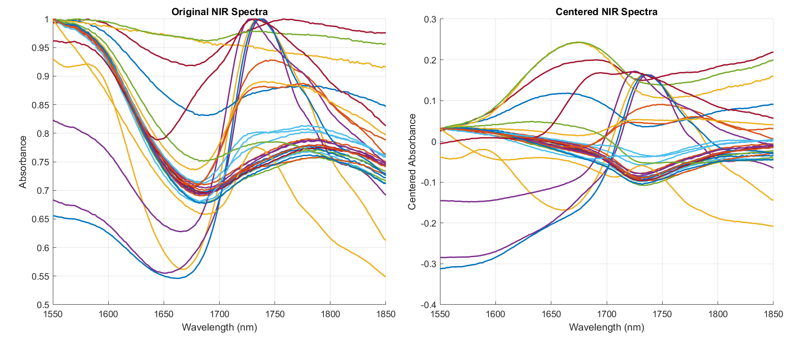
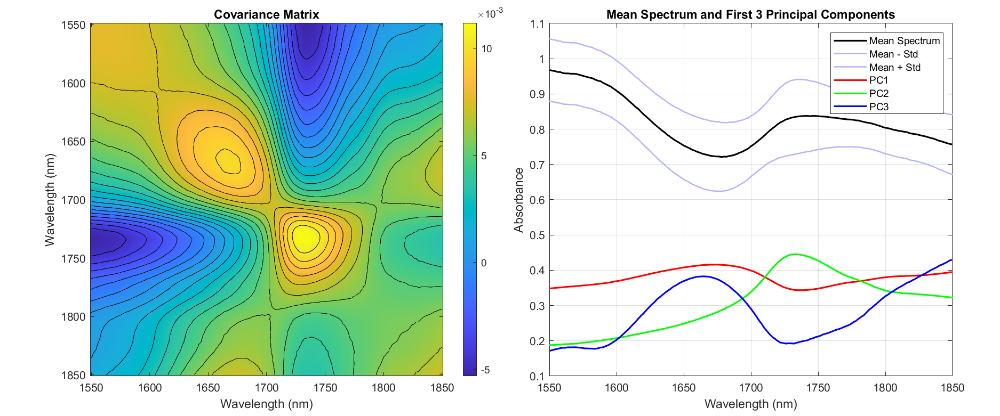
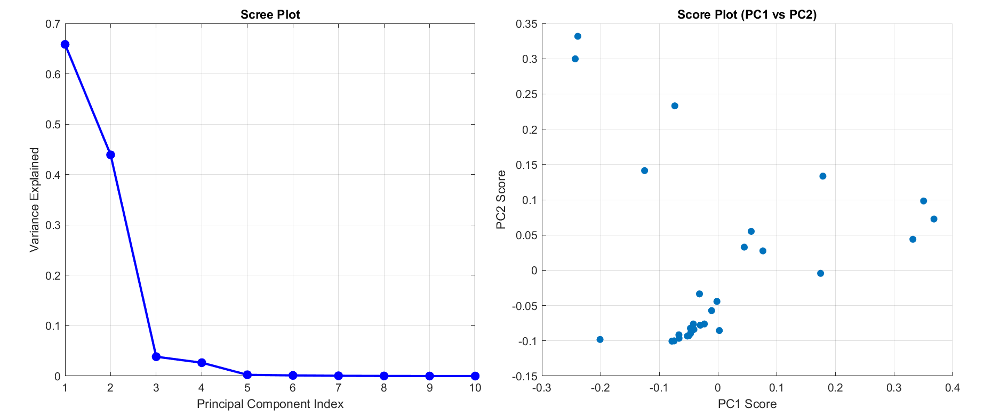
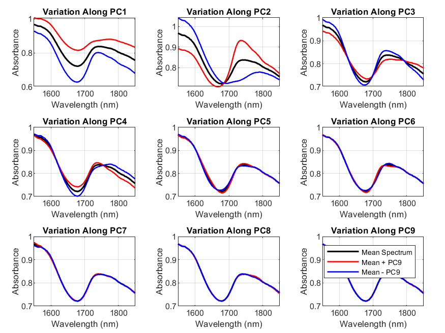

# NIR Spectral Analysis of Treated Cotton Fabrics

This repository contains the results of a Principal Component Analysis (PCA) applied to Near-Infrared (NIR) absorbance spectra collected from approximately 30 cotton fabric samples, each subjected to different surface treatments.

## 📊 Objective

The goal of this analysis is to explore patterns, variability, and distinguishing features in the NIR spectra of cotton fabrics, enabling potential classification or treatment-effect detection.

---

## 🧪 Dataset Description

- **Samples**: ~30 cotton fabric swatches  
- **Measurement**: NIR absorbance spectra  
- **Wavelength Range**: 1550–1850 nm  
- **Preprocessing**: Mean centering applied before PCA  

---

## 🔍 Analysis Overview

### 1. **Original vs Centered NIR Spectra**

  

- **Left**: Raw absorbance spectra show distinct spectral shapes depending on surface treatments.
- **Right**: Centered spectra reveal more about relative differences, preparing the data for PCA.

---

### 2. **Covariance Structure and Principal Components**

  

- **Left**: Covariance matrix contour plot showing spectral regions with strong joint variation. The 1650–1750 nm region shows especially high covariance—indicative of treatment-sensitive zones.
- **Right**: Mean NIR spectrum (black), standard deviation bands (light blue), and the first 3 principal component loading vectors (PC1: red, PC2: green, PC3: blue). These PCs highlight the dominant modes of variation in the data.

---

### 3. **PCA Scree Plot and Score Distribution**

  

- **Left (Scree Plot)**:  
  - PC1 explains ~66% of the variance  
  - PC2 explains an additional ~45%  
  - Over 90% of total variance is captured by the first two components

- **Right (Score Plot)**:  
  - Score distribution in the PC1–PC2 space shows clustering, indicating sample differentiation based on treatments.

---

### 4. **Spectral Variability Along Each Principal Component**

  

- Each subplot shows how moving ±1 standard deviation along a PC affects the reconstructed spectrum.
- PC1 and PC2 introduce the most significant changes—mainly around 1650–1750 nm.
- Higher-order PCs (PC4–PC9) contribute minimal variation.

---

## 🧠 Key Insights

- Most of the spectral variability is captured by PC1 and PC2.
- The 1650–1750 nm wavelength range is the most responsive to treatment effects.
- PCA reveals latent structure in the spectral data and can be used for classification or regression modeling.

---

